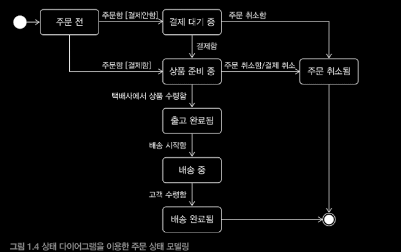
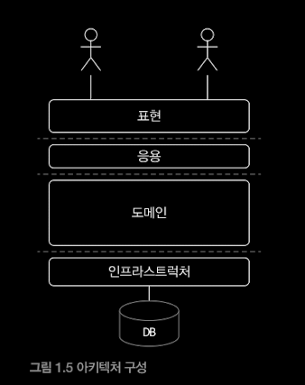

## TOC : 

1. What is Domain?
2. Domain Expert와 개발자간의 지식공유
3. What is Domain Model?
4. Domain Model Pattern
5. Domain Model 도출
6. Entity and Value
    - Entity
    - Entity 식별자 생성방법
    - Value Type
    - Entity 식별자와 Value Type
    - 도메인 모델에 setter 없애기
7. 도메인 용어와 유비쿼터스 언어

## SQ3R

### Q: What is Domain?

- 👉 SW로 해결하고자 하는 문제 영역.

- 한 도메인은, 다시 하위 도메인으로 나눌 수 있다.

    - 예) 온라인 서점 도메인의 하위 도메인 : 주문, 결제 , 배송, 정산, ...

- 도메인마다 고정된 하위 도메인이 존재하는 것은 아니며, 이를 어떻게 구성할지 여부는 상황에 따라 달라진다.

### Q: Domain Expert와 개발자간의 어떠한 지식 공유가 필요한가?

- 도메인 전문가들은, 자신이 가지고 있는 지식과 경험을 바탕으로, 개발자에게 본인들이 원하는 기능 개발을 요구한다.

- 개발자는, 이런 요구사항을 분석하고 설계하여 코드작성, 테스트, 배포한다.

- 이때 요구사항은 첫 단추와 같다. 요구사항 분석에 실패하면 모든 단추가 잘못끼워진다. **"Garbage in,Garbage Out"**

- 따라서 요구사항을 올바르게 이해하는 것이 제일 중요하다.

- 그럼 어떻게 해야 올바르게 이해할수 있나?

- 직접 개발자와 도메인전문가가 대화 하는 것이다.

- 👉 결국 개발자와 도메인 전문가 간의 직접적인 커뮤니케이션을 통한 요구사항 및 인식의 차이를 줄이는 활동이 필요하다라는 것.

### Q: What is Domain Model?

- 👉 특정 도메인을 개념적으로 표현한 것. 즉, 도메인 자체를 이해하기 위한 개념 모델이다.

- ❓ 그렇다면, 도메인을 이해하기 위해서는 어떤 방법이 필요한가?

- 👉 **도메인이 제공하는 기능과 주요 데이터 구성을 파악할 필요가 있다.**

- 이런면에서, 기능과 데이터를 함께 보여주는 객체 모델이 도메인 모델링시 적절하다.

- 또한, 클래스 다이어그램과 상태 다이어그램을 이용해 적절하게 도메인 이해를 도울 수 있다.

- 이때, 개념 모델을 이용해 바로 코드 작성가능하지않으므로 해당 구현 기술에 맞는 구현 모델이 따로 필요하다.

#### Note : 

- 또한, 앞서 말햇듯, 도메인은 다수의 하위 도메인으로 구성될 수 있다

- 이때, 각 하위도메인이 다루는 영역은 서로 다르기 때문에(겹치지 않기에), 

- 같은 용어라 할지라도, 도메인마다 의미가 달라질 수 있다.

> 예) 상품이라는 용어는,

> 카탈로그 도메인에서는, 상품 가격, 상세 내용을 담고 있는 정보를 나타내며,

> 배송 도메인에서는, 고객에게 실제 배송되는 물리적 상품을 나타낸다

- 따라서, 결론적으로, 각 하위도메인마다 별도의 도메인 모델을 만들어야 한다.

### Q: What is Domain Model Pattern?

- 일반적인 앱 아키텍처는 다음과 같이 4개의 영역으로 구성된다.

- 👉  위 아키텍처 상의 도메인 계층을, 객체 지향으로 구현하는 패턴을 도메인 모델 패턴이라고 한다.(엔터프라이즈 애플리케이션 아키텍처 패턴 참고)

- 더 쉽게 말하면, 도메인 계층의 객체 모델을 표현 할 때 도메인 모델이라고 표현한다.

- 이때 도메인 계층은, 시스템이 제공할 도메인의 핵심 규칙을 구현한다.

    - 예) 주문 도메인의 경우, 다음과 같은 도메인 규칙들을 구현한 코드가 도메인 계층에 위치하게 된다
        - 배송지변경은, 출고 전에만 가능하다
        - 주문 취소는, 배송전에만 가능하다

- 이를 통해, 도메인 규칙이 도메인 계층에만 위치하기때문에, 규칙 변경시 다른 영역의 코드에는 영향없이 변경이 가능하다(SoC)

#### From: 엔터프라이즈 애플리케이션 아키텍처 패턴 

> 

### Q: 구현 도메인 모델 도출, HOW?

#### 전제 조건 :

- 요구사항 분석을 통한 도메인 이해.

- 이를 바탕으로 순수하게 문제를 분석한 결과인 개념 도메인 모델 작성.
 (당연하지만 완벽할 필욘 없다, 전반적 개요를 알수 있는 수준에서 시작)

- 작성한 개념 도메인 모델을 바탕으로 구현 가능한 형태의 도메인 모델로 점진적 발전을 통해 구현해나간다.

#### 어떻게 도출할 수 있을까? 어디서 부터 시작해야 하나?

- 👉 **요구사항으로부터 핵심 규칙, 핵심 기능을 찾는 것부터 시작.**

- **이후, 점진적 구현을 통해서 발견할 수 있는 규칙, 제약들을 도출해나간다** 

### Q: Entity vs Value Object?

도출한 구현 도메인 모델은, Entity와 Value로 구분할 수 있다.

Entity와 Value를 제대로 구분해야 도메인 설계 및 구현할 수 있다.

#### Entity

특징 : 

- 엔티티 객체마다 고유한 식별자를 가진다.

- 예) 주문 도메인에서의 각 주문은, 주문번호를 통해 식별할 수 있으니, 주문번호가 식별자가 된다.

- 해당 식별자를 통해, 객체의 동등성 체크를 수행할 수 있다.

식별자를 생성하는 방법 : 

- 당연하겠지만 도메인의 특징 및 사용 기술에 따라 달리진다

- 특정 규칙

- UUID / Nano ID와 같은 고유 식별자 생성기 사용

- 일련번호 사용

- 흔히, 현재 시간과 다른값을 함께 조합하는 경우가 많다.

- Entity 식별자를, Value Type으로 표현 할 수도 있다.

    - 해당 식별자가 도메인에서 특별한 의미를 지니는 경우, 해당 의미를 명확하게 표현하기 위해.

#### Value

- What?When? : 개념적으로 완전한 하나를 표현할때, 또는 도메인 의미, 규칙을 명확하게 표현하기 위해 사용한다.

    - 예) 주문을 받는 수령인 개념을 나타낸 Receiver 객체

    - 예) 주소 개념을 나타낸 Address 객체

    - 예) OO 객체 생활 체조 원칙중 하나인 원시값 포장이 여기에 해당된다

- 특징 :

    - Value Type을 위한 기능을 추가 할 수 있다.

    - 일반적으로 불변으로 구현한다. (참조투명성과 쓰레드 세이프하기 위해)

    - 따라서 no setter, 객체 생성시 valid한 객체 생성, Valute type을 위한 기능 추가시, 새 객체 반환등.

아직 Entity의 정의를 잘 모르겠다.

Entity와 Value의 차이점도 잘 모르겠고.

식별자가 있으면 엔티티인가? 그렇게 생각하지 않는다. 밸류 타입에는 식별자가 있을 수도 있으니.

### Q: 유비쿼터스 언어가 뭐죠? 그걸 언제 쓰라고 하는 거죠?

What? : 

대화, 문서, 도메인 모델, 코드, 테스트 등 프로젝트의 모든 곳에서 사용되는 같은 용어.

Why? : 

효율적이고 버그가 적은 개발을 위해.

= PIC들간의 용어 해석 차이의 모호함 제거 및 도메인과 코드 사이에서의 불필요한 해석과정 제거를 위해.

When to use? :

프로젝트의 모든 곳에서.

### Q: Value Object vs Reference Object ?

